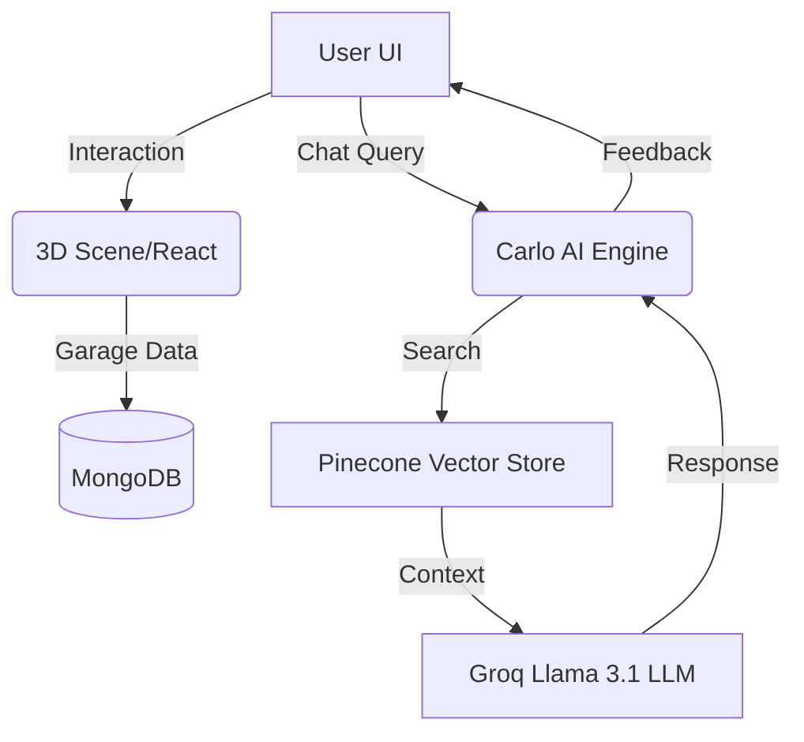

# 🚗 CarCare AI: The Future of Automotive Intelligence

[](https://github.com/apurb2509/CarCareAI)
[](https://github.com/apurb2509/CarCareAI)
[](https://github.com/apurb2509/CarCareAI)

**CarCare AI** is a cutting-edge SaaS ecosystem designed to bridge the gap between modern machines and master mechanics. By combining real-time 3D visualization, AI-driven diagnostics (RAG), and a sleek interactive interface, we provide an unparalleled automotive care experience.

---

## 🌟 Key Features

### 🤖 AI-Powered RAG Chatbot (Carlo)
*   **Intelligent Diagnostics**: Carlo uses Retrieval-Augmented Generation (RAG) to provide pinpoint-accurate advice based on vehicle manuals and live data.
*   **Guardrailed Conversations**: Specialized engine ensures Carlo stays focused strictly on automotive care and troubleshooting.
*   **LangChain & Groq**: High-speed inference using Llama 3.1 models for instant, human-like responses.

### 🏎️ Real-Time 3D Visualization
*   **Interactive Car Parts**: Visualize vehicle components in a high-fidelity 3D space using React Three Fiber.
*   **Immersive Background**: A dynamic, scroll-responsive 3D "Smart Wheel" environment that reacts to user movement.
*   **Part Highlighting**: Interactive selectors to identify and inspect specific mechanical parts.

### 📍 Smart Location & Service Engine
*   **Nearby Stations**: One-click geolocation to find car service stations in your immediate vicinity.
*   **Trusted Network**: Only registered and verified stations appear in the ecosystem, ensuring quality and trust.
*   **Real-Time Status**: Live server-side monitoring of service station availability.

### 🏠 Virtual Garage & Profile
*   **Inventory Management**: Track multiple vehicles, their service history, and health status in a digital garage.
*   **Personalized Experience**: Advanced profile settings to customize your car care journey.
*   **Part Model Selection**: Choose and preview different car models and parts in real-time.

---

## 🛠️ Tech Stack

### Frontend
- **Framework**: React 19 (Vite)
- **UI & Styling**: Chakra UI (Premium Theme-aware Architecture)
- **Animations**: GSAP (ScrollTrigger), Framer Motion
- **3D Engine**: Three.js, @react-three/fiber, @react-three/drei
- **Utilities**: React Router, React Icons, html2pdf.js, QRcode.js

### Backend
- **Server**: Node.js, Express.js
- **Database**: MongoDB (User Data), Pinecone (Vector Database for RAG)
- **AI/LLM**: Groq (Llama 3.1), LangChain, HuggingFace (Embeddings)
- **Processing**: Multer (File Handling), PDF-Parse (Manual Ingestion)

---

## 🚀 Getting Started

### Prerequisites
- **Node.js**: v18+ 
- **MongoDB**: A running instance (local or Atlas)
- **API Keys**:
  - `GROQ_API_KEY` (Inference)
  - `PINECONE_API_KEY` & `PINECONE_INDEX_NAME` (Vector Storage)
  - `HUGGINGFACEHUB_API_TOKEN` (Embeddings)

### Installation

1.  **Clone the Repository**
    ```bash
    git clone https://github.com/apurb2509/CarCareAI.git
    cd CarCareAI
    ```

2.  **Setup Backend**
    ```bash
    cd backend
    npm install
    # Create a .env file based on the prerequisites above
    ```

3.  **Setup Frontend**
    ```bash
    cd ../frontend
    npm install
    ```

### Running the Application

For a complete experience, you must run both the backend and the frontend:

**Backend:**
```bash
cd backend
node server.js
```

**Frontend:**
```bash
cd frontend
npm run dev
```

The application will be available at `http://localhost:5173`.

---

## ⚙️ Workflow

1.  **Onboarding**: Users or Service Stations register their accounts and profiles.
2.  **Virtual Garage**: Owners add their vehicles to the Digital Garage for tracking.
3.  **Diagnostic Phase**: Users interact with **Carlo (AI)** or the **3D Component Viewer** to identify issues.
4.  **Action Phase**: Use the **Smart Location Engine** to find the nearest trusted garage and book/view services.
5.  **Report**: Generate health reports via the PDF export feature.

---

## 🏗️ Architecture



---

## 🤝 Contact & Credits

**CarCare AI Team**
*   **Developers**: Apurb ([GitHub](https://github.com/apurb2509)) & Susovon ([GitHub](https://github.com/susovonpatra))
*   **Project**: CarCare AI - Smart Automotive Ecosystem

---

© 2026 CarCare AI. All rights reserved. Professional Grade Automotive Intelligence.
